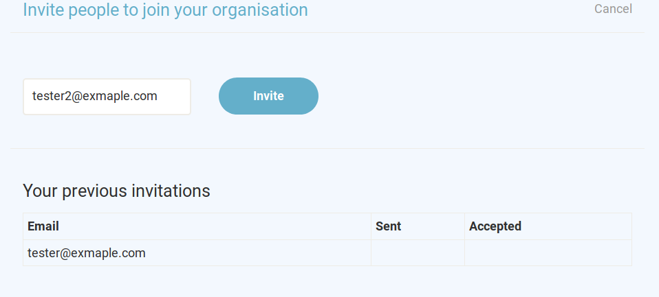

Administrators of an organisation can edit organisation details and add users 
to participate on Toucan. The organisation settings page can be reached from 
the users profile editing page and looks like this. 

Organisations can define a few profile settings, such as contacvt information. 
All these fields can be changed under *Edit organisation details*.

## Inviting Users

Onboarding new members in Toucan works by inviting them to your organisation. 
After entering their email address users will receive an email with further information. 
This involves clicking a link in that email that will then allow them to set up their own profile.

   

